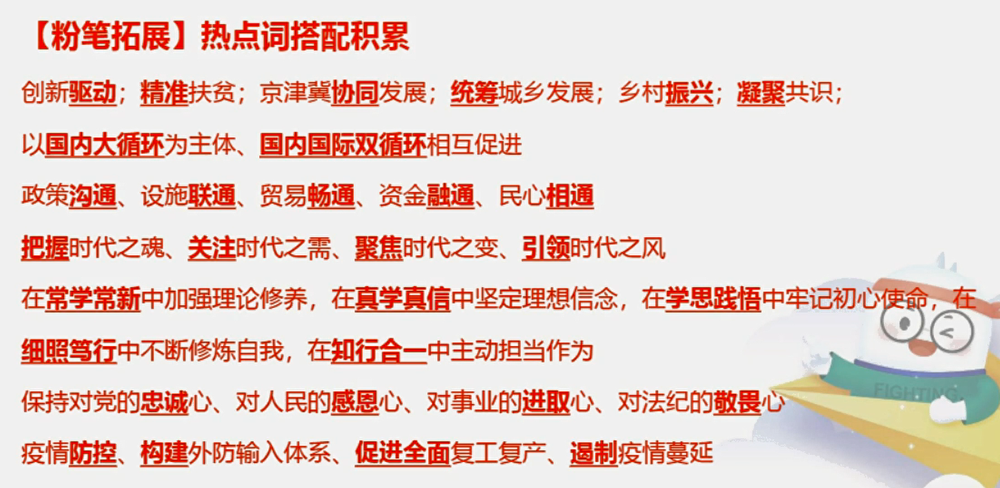
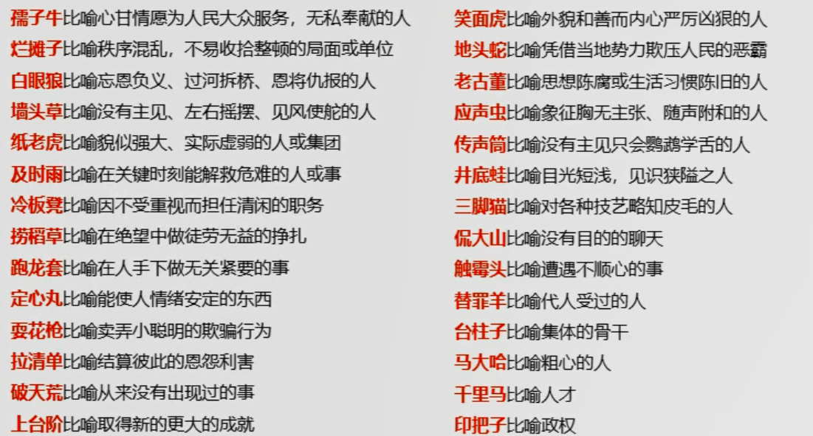
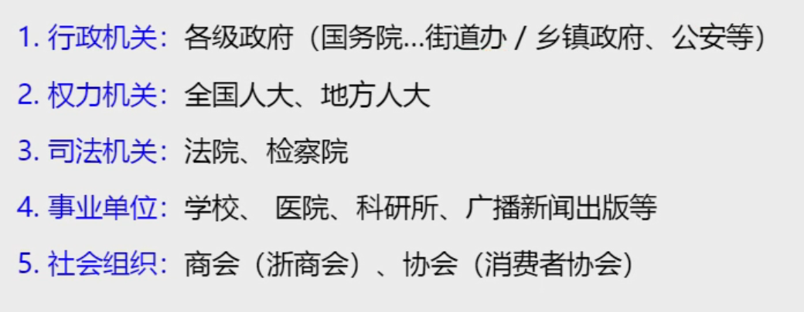

- [自学备考专技计算机事业单位](#自学备考专技计算机事业单位)
  - [行测部分 40分](#行测部分-40分)
    - [言语](#言语)
      - [片段阅读](#片段阅读)
        - [中心理解题](#中心理解题)
        - [细节判断题](#细节判断题)
      - [语言表达](#语言表达)
        - [语句排序题](#语句排序题)
        - [语句填空题](#语句填空题)
        - [接语填空题](#接语填空题)
      - [逻辑填空](#逻辑填空)
    - [资料分析](#资料分析)
      - [速算技巧、基期与现期](#速算技巧基期与现期)
        - [截位直除](#截位直除)
        - [分数比较](#分数比较)
        - [基期与现期](#基期与现期)
      - [一般增长率](#一般增长率)
      - [比重、平均数](#比重平均数)
      - [倍数和特殊增长率](#倍数和特殊增长率)
    - [判断推理](#判断推理)
    - [数量关系](#数量关系)
  - [专业知识方面 60分](#专业知识方面-60分)
# 自学备考专技计算机事业单位
>复习比较迟，要不是疫情推迟，笔试都考完了，今天是2022/4/29，考试时间还没公布。现在开始复习进行一些记录
- 首先笔试试题构成,总分100，目标70-75分
    - 行测 总分40分，目标30分，重点方法和提高刷题（单选共60道，申论可以不看）
      - 公基 10-15题（10分）
      - 言语 10-15题
      - 判断推理 25-30题
      - 数字计算 10题（后面一共30分）
    - 专业知识 
        - 单选题10题，总分5分，不好复习，范围较广
        - 多项选择题5题，总分5分，不好复习，范围较广,这两项目标4-5分
        - 简答题2题，总分10分，东西分散，但是不难，目标6-7分
        - 实务题3题，总分40分，得实务题者得天下，目标30-35分
            - 数据库
              - 增删改查
              - 关系模式转换
              - ER图绘画
              - 了解常用数据库
            - 网络工程
              - 熟悉常用网络设备名称
              - 熟悉基本得网络相关理论和协议
              - 能进行基本的网络计算
              - 会画简单的网络拓扑图
            - 软件工程
              - UML
              - DFD数据流图
              - 软件开发的基本理论
              - 考察形式多样
            - 程序和算法
              - 熟悉基本程序语言（C、CPP、C#、JAVA、PYTHON等）
              - 会写伪代码
              - 能读懂程序，会简单修改
              - 熟悉经典的算法
- 复习计划
  - 行测基础知识
  - 计算机真题
  - 行测提高刷题
  - 实务题专项提高
  - 放松心态考试
  
  
## 行测部分 40分
>学习资料就是粉笔职教的980系统课程（我是网盘看的，买不起）
### 言语
分为以下三大类
#### 片段阅读
第一节课课程重点：
  - 转折因果关联词及重点位置
  - 主题词的特征
  - 错误选项的特征
    - 转折前的内容
    - 围绕解释说明的表述
    - 无中生有
    - 围绕问题的表述
    - 围绕意义和效果的表诉
    - 偷换概念，或者返回扩大或缩小
    - 表诉片面
    - 描述主体片面

第二节课课程重点：
   - 对策标志词及行文脉络
   - 反面论证的用法
   - 程度词及其作用
   - 并列关系的文段特征

第三节课课程重点：
   - 中心理解题的中心句和分述句的特征
   - 细节判断题解题思维和错误选项特征

>解题顺序：提问->文段->选项
>>忠于文段，对比择优
##### 中心理解题
- 提问方式

- 解题思路
  - 有中心句：对答案进行同义替换
  - 无中心句：全面概括
- 解题技巧
  - 重点词语：比如关联词、主题词、程度词
    - 关联词之转折,如虽然但是、尽管可能、不过、然而、却、其实、实际上、事实上
    要点：转折之后是重点,且转折前后的意思完全相反
    错误选项的特征：对转折前进行描述，对解释说明的部分进行描述，无中生有 
    对于描述的语句可以进行略读：比如列如诸如譬如因为由于冒号破折号近年来随着在XX背景下等等
    - 主题词判断方法
      - 中心句的核心话题，前有引用，后有解释 
      - 每句话都围绕相同话题，高频出现，有可能用代词，你我他
      - 答案中需要有这个主题词
      - 如果有一个主体词要找准，有两个要找全
    - 关于主题词的错误选项特征：描述非重点（转折前的内容、解释说明的表述）、无中生有、偷换概念
    - 关联词之因果关系，如因为所以、由于因此、因而、故而、于是、可见、看来、故、导致、致使、使得、造成等
    结论是重点，因果文段正确答案的新宠是XXX的缘由这类，需要额外关注。
    - 必要条件关系：只有A才B；充分关系：只要A就B。后者出现概率低，重点是前者，可能是把才换成放能等词语，所以前面条件是重点，答案要包含前者
    - 当然只考察必要条件的题目较少，对策题常考，标志词有下图所示

    - 对策的行文脉络以及问题的标志词如下图所示，补充一点开启新通道也是一个对策标志词

    - 对策题真确答案新宠是对中心句进行拟人、比喻等形象的表达同义替换，需要格外关注
    - 反面论证：一般格式有：如果、倘若、一旦+不好的结果，一般把前面的做法反过来就是正确答案，有两个常见的错误答案：假设变成现实、反面论证中的后果
    - 有时候文段只有问题的表述，没有给出对策，对策再选项中，这个时候我们要选择有针对性的的对策来解决问题，如果没有合适的对策，就选问题描述的本身的答案
    - 常见的程度词如下图所示,在读材料时要结合整体的结构和脉络

    - 并列关系的文段特征和错误选项特征如下图,另外还要判断主体是否正确，不要张冠李戴
 
  - 行文脉络：总分、分总、总分总、分总分、分分
  - 中心句的特征：形式上是重点词提示，内容上是作者的一些观点，如结论、对策、评价；分述句的特征：举例子、数据资料、正反论证、原因解释、并列分述
##### 细节判断题
- 一般的提问方式为：以下对文段理解正确/不正确的选项的是、符合/不符合这段话意思的是、从文段中可以得知/推出的是
- 仔细阅读即可，如果文段难以理解那么先读选项，如果通俗易懂就反之
- 一般的错误选项有几个特征：无中生有、偷换概念、偷换逻辑、偷换时态
- 需要额外注意的选项特征：数字、名字、字母、标点符号还有核心名词
- 如果出现并列结构，如文段说明a同时/加上b，那么选项中a导致/反映/影响/b、以a为主、b为核心都是错误选项
- 快速解题技巧：1.无关对比2.相对表述比绝对表述更有可能是正确答案 3.表述和事实不符  这些选项优先验证
#### 语言表达
第四次课学习重点：
- 语句排序题的解题思维
- 确定首句、捆绑集团、顺序、末尾句的方法和应用
- 语句填空题的解题思维和技巧

第五次课学习重点：
- 接语选择题的解题思维和技巧
- 接语辨析的方法和应用
- 转折关系和因果关系在逻辑填空题中的应用
##### 语句排序题
- 提问方式：将以下几个句子重新排列组合最连贯的是？
- 做题顺序：从选项入手，不能靠语感，要看句子之间逻辑
- 先确定首句或者尾句，注意句子之间的顺序和绑定
- 首句特征：下定义，如就是、是指、所谓、指的是；背景引入，如随着、近年来、在...大背景/环境下
- 非首句特征：关联词的后半部分；代词单独出现，人称代词（你我他）、指示代词（这那此）
- 确定捆绑集团，
  - 方法一：代词捆绑,这那他该其/这些他们这些可以确定连贯的几句。
  - 方法二：关联词捆绑，配套出现，或者单独出现的话，就分析句子意思，如但、同时等
- 确定顺序：
  - 时间顺序：具体年份、朝代、过去现在将来，注意话题一致
  - 逻辑顺序：观点+解释说明或者提出问题+解决问题或者A和B，如果解释的话就先A后B或者日常逻辑，比如先山脚后山腰这样
  - 确定尾句：结论和对策的表诉，如因此、所以、看来、于是、这......
##### 语句填空题
- 提问方式：填入横线部分最恰当的一项
  - 横线在结尾：总结和对策
  - 横线在开头：
    - 常规就是概括文段
    - 创新考法，横线后出现关联词，注意前后逻辑衔接
  - 横线在中间：注意上下文的联系，把握主题词，保证文段话题一致
##### 接语填空题
- 提问方式:作者接下来最有可能讲述的是？
- 方法：通读全文，关注核心话题，确保话题保持一致和连贯，对比选项确定答案
- 错误选项特征：文段中已经描述过的内容、话题不一致不连贯
#### 逻辑填空
>实词填空、成语填空、混搭填空三种考法
第六次课重点知识：
- 并列关系在逻辑填空中应用
  - 出现顿号逗号是同义并列的特征；出现不是而是，是不是，想反，反之等是反义并列的特征
  - 句式相同或相近，根据句意判断相同或相反
- 解释类对应的特征与运用
  - 即、就是、可谓、可以说、无异于、无疑是或者冒号、破折号又或者没有标志通过前后分句进行解释说明
- 重点词句对应的分类与应用
  - 形象表达，标志有比如、有如、就像、类似、“”等，所填词语与形象表达的词语形成对应
  - 指代词，这此那彼，所填词语和指代内容形成对应
  - 主题词，也就是核心话题，所填词语要和他对应
  - 前后呼应，没有明显标志，所填词前后文形成对应
- 词的辨析
  - 词义侧重，可以把不一样的字拿出来组词
  - 固定搭配，如经济新常态、协同发展，热点词积累如下图

>如果横线后面和、及、与引导的并列结构，所填的词语应该都要搭配
  - 程度轻重，如缺陷、缺点、瑕疵或者截然相反、大相径庭。所以所填词语的程度与文段意思轻重保持一致
  - 感情色彩 ，如成果、结果、后果或者趋之若鹜、争先恐后或不胜枚举、罄竹难书。有褒义、贬义、中性词，选择时注意与文段保持一致
- 语境分析
  - 关联关系，转折因果并列
    - 转折，前后就不同
    - 因果，前后有因果关系
  - 对应关系
### 资料分析
- 一般是官方统计的材料，考察对统计术语的理解和分析、处理数据的能力
- 题型稳定，容易得分
#### 速算技巧、基期与现期
##### 截位直除
- 截位就是四舍五入地截取前几位数字
- 截分母还是分子：如果是一步除法就截分母；如果是多步除法分子分母都进行截取，然后约分计算。
- 到底截取几位：如果选项之间差距大，那么我们就截两位，如果选项之间差距小，那么就截三位。具体一点的定义就是四个选项的首个数字都不同，就认为差距大，另外如果有守卫数字相同的但是第二位的差大于首位，也认为差距大，反之如果差小于等于首位，就是差距小
- 特殊情况：选项之间比有10倍或者100被的关系，无法确定选哪个。处理方法，把量级统一，尽量使除数变小，估算出商是几位数。
>注意，要找最接近的的选项之间的差距，如果是99、100这样的任务差距小
>小技巧：如果判断出来选项差距大，那么可以灵活的在分子分母上+-1使得编程偶数，这样可以口算得出结果
##### 分数比较
- 一大一小
    - 意思就是分子是大于另一个分数的分子的，而分母是小与另外一个分数的分母的。这样的话，这个数就比另外一个分数大。我们可以用钱多人少来理解
- 同大同小
    - 笨方法：按照之前的方法分母截取两位直接算
    - 看一看分子与分子之间，分母与分母之间的倍数
      - 如果分子之间倍数大，看分子，分子大的数大
      - 如果分母之间倍数大，看分母，分母小的数大
      - >注意一点：如果无法比较分母倍数大和分子倍数大，我们可以尝试更细一点地计算谁的倍数更大。或者看看到没到一半，这样比较
>如果同时比较的数字较多，先去掉负数，我们可以看一大一小（如果没有，可以在尝试看看3个里面有没有一大一小），再看同大同小

>如果在比较时，有个由于量级不一致导致不太好算，我们可以先把分母量级调整一致，就是同时乘除10的倍数的方法
##### 基期与现期
- 通俗理解，时间在前就是基期，靠后就是现期
- 增长量就是变化地绝对值，相减就好；增长率就是增长量比上基期
- 一般题型
  - 求基期量：给现在的量，求过去的值
    - 如果给增长量，那么就是减一下
    - 如果给增长率，基期量=现期量/(1+增长率)
    - >注意有可能增长率是负数
  - 衍生题型：比较基期量的大小：现期量大且增长率小的基期量一定大，可以进行两两比较，如果还不行的话就计算嘛。
  - 衍生题型：求基期两件物品的差值，可以先排除现期的差值选项，然后画出数轴，来观察现期差值与基期差值的大小关系，运气好可以直接选出答案。 
  - 求现期量：给现在的量，求将来的值
    - 如果给增长量，就加一下
    - 如果给增长率，就用现期量=基期量*（1+增长率）
- 同比和环比：同比是和去年同期相比，环比是和上一个统计周期相比（前一个月或季度）
- >如果增长率的绝对值在5%以内，可以使用公式计算（化除为乘）：现期*(1-增长率)或者现期*(1+增长率)。加还是减看的是增长率的正负
#### 一般增长率
- 几个词语的含义：
  - 百分数：表示两个量的比例关系，用除法计算
  - 百分点：表示百分数的变化，用加减法
  - 增长率：（现期-基期）/基期 
  - 倍数：前面的除以后面的；倍数等于增长率加一
  - 成数：就是十分之几
  - 翻番：翻一番就是两倍，翻两番就是四倍，n番就是2的n次方
  - 增幅：就是增长率，可正可负，如果比较的话，带符号比较
  - 降幅：必须为负，比较绝对值
  - 变化浮动：直接比较绝对值
- 一般增长率题型，问增长下降了百分之多少，给百分点，加减计算
- 高频易错点，如下图所示：

- 或者给具体的量，求增长率，公式为增长量比上基期量，可能没有直接的这两个数据，通过计算获得。
- 如果提问多个年份增长率大于10%，可以简化为下图形式

- 如果问比较类的增长率，谁最快，谁最慢，我们可以转换求增长率的公式为现期/基期再减一，所以我们现在就看现期和基期的倍数，倍数越大，增长率越大；如果不能看出来，首先观察是否基期在变大，然后看看是否增长量一直在减少，如果满足前面这两个条件，那么就可以说第一年增长率最高，否则就就列出分数，然后比较，观察有无钱多人少的情况。
- 一般题型问增长量，题型有简单的给出现期和基期
- 其次问年均增长量：（现期-基期）/年份差
  - 一般情况算年份差就直接减
  - 五年规划啥的都要确定五年
  - 如果是江苏省内考试，那么第一年的也要算，就是+1年的年份差
- 给现期和增长率，求增长量 ；公式：增长量=基期*增长率=现期/（1+增长率）*增长率=现期/（增长率的倒数+1）（如果是减少就-1）
- 下面看下常见百分数的倒数图

- 如果碰到左右为难的那么就取中，如果碰到百分数较大或者较小的情况，可以进行放缩，就是乘除10找到熟悉的选项
- 另外考察增长量的比较，如果给出现期和基期，就直接减一下，如果给出柱状图，看柱状图的高度差
- 如果给出现期、增长率，比较增长量，大大则大的口诀：现期量大，增长率也大，所以增长量就大；一大一小，要进行计算
#### 比重、平均数
- 现期比重：比中就是部分比上总体，那么这三个量就都可以求
- 利润率在数学中是利润比上成本；在资料分析中是利润比上收入
- 贡献率：就是比重，增长贡献率=部分增长量/整体增长量
- 计算基期比重：公式如下tu

>速算技巧：先截位直除A/B，然后看右边部分是否大于1，之后结合选项算出来结果，这个时候如果看不出来，可以选一个最接近的选项，这样的正确率高达80%，如果不想碰运气且满足以下条件的一个：
1. |a-b|<=5%
2. |a|<=5%
>那么(1+b)/(1+a)约等于1+b-a
- 两期比重比较 ：公式 比重差（现期比重-基期比重）=A/B*（a-b）/（1+a）  
  1. a>b,比重上升
  2. a<b,比重下降
  3. a=b，比重不变
  4. a和b带正负号计算和比较
- 如果要求计算出两期比重差的几个百分点，可以选一个小于|a-b|值得选项，如果有多个，代入计算
- 现期平均数，看清题目，直接计算即可
- 基期平均数，计算公式同基期比重，考的较少

- 两期平均，判断升降同两期比重，如果要具体数值公式如下：（a-b）/（1+b）
#### 倍数和特殊增长率
- 现期倍数
  - 几个概念：
    - A是B得几倍，直接÷就好
    - A超过B的几倍，超过就是A>n*B
    - A比B多几倍，（A-B）/B=A/B-1
- 基期倍数

- 间隔增长率：如2020年比2018年增长XX%，隔一年求增长率。公式：r1+r2+r1*r2
>如果r1和r2的绝对值都小于10%，后面乘积可以忽略，主要看前两个之后，如果不能排除，百分数化为分数来计算
- 如果要求隔一年的倍数，先求出间隔增长率，然后加一
- 延伸题型：求间隔基期量：先求基期增长率，然后用现期量除以（1+间隔增长率）
- 年均增长率：公式（1+r）^n=现期量/基期量；n是年份差，r就是年均增长率
- 如果要比较大小，年份差（n）相同，就比较现期量/基期量的值
- 如果考求平均增长率，开方比较难，我们可以代入计算
- 混合增长率：已知部分数据和另外一部分数据，求总体数据，总体数据一定在最小和最大的之间，而且偏向基数较大的
### 判断推理
- 图形推理
- 第一节：位置规律
  题型特征：元素组成相同或者基本相同
  - 平移：方向上：直线（上下左右对角线）或者绕圈（顺时针和逆时针）；步数有不变有递增（几乎没有递减）。
    - 宫格型黑块平移：个别图少一个黑块，考虑是否重合，元素组成相同时、相似时（可能重合）考虑该题型。
    - 如果16格中，中间黑块数量相同，优先考虑内外转圈,即回字形转圈，空白也可以作为元素。
    - 解题思路为：大多数元素相同，考虑平移，然后宫格型黑块平移先看下中间四格的元素是否相同，是的话，就是内外转圈，优先看内，然后看外圈
    
  - 旋转：有顺时针和逆时针两个方向，常见角度有：30、45、60、90
  - 翻转：有左右翻转和上下翻转
  - 相加、相减、求同、求异。当看到相似图形的时候要注意求异，前面几乎不考，同时还要看看结果经过变换
  - 黑白运算，如果出现黑白相加然后出现结果的情况，根据题型总结运算规则，和平移、旋转等区分要看看黑白块数量一不一样，当然前面提到有可能会有重合的特殊情况
  - >技巧，查看选项之间差异找答案

元素不相同也不相似时，要考虑熟悉规律
  - 轴对称和中心对称或者两者都有的，还会从对称轴的数量和方向进行考察，还有可能考察对称轴和图形中元素（线、点、面）的关系
  - 元素的曲直性，就是组成元素线条的曲直：三种组合，曲、直、曲加直
  - 开闭性：就是元素整体是否闭合，注意半开半合的情况
  - 特殊规律
    - 图形之间规律：相离、相交与点线面
    - 如果都是相较于边的情况，可以看几条、看长短、看是否部分相交、是否曲线，当然我们先考虑的是对称的规律性
    - 如果都似乎相交于面的情况，可以看看相交面的形状（几边形）和属性（对称和曲直），相交面和外面图形的关系
    - 功能元素：如出现点、箭头等元素

同样的，可以总结图形之间关系

 

元素同异的做题思路如下图

 

  - 数量规律：元素不同，且属性没规律或者数量特征明显
    - 面的数量：切分面或者生活常见的图标
  
    

    - 当出现多边形或者单条线的时候，数直线；当出现圆、弧线、单一曲线时数曲线图形
- 笔画数
  - 判断图形能否一笔画：线条之间联通，奇点数量为0或者2，最少笔画数为奇点数的一半。这种题目的明显特征有：五角星，日，田，圆相切/相交及变形图或者出现明显端点
  - 点的数量：当出现交叉明显，相切较多的图时，考虑数点。细化讲就是切点和曲直交叉点
  - 角的数量，如下图所示
  
  - 素的数量,颜色不同为两种，为两种，大小不同为一种
  
  - 部份数的考点
  
- 空间重构
  - 相对面，在同一列和同一行隔一个面，或者在Z形中线两侧，相对面不能同时出现，所以可以来排除
  - 如果在图片中，出现一些相对的图形指向，那么可以用这个指向来排除选项
  - 如果立体图的三个面在展开图中挨着，就看公共点，如果没有就看公共边
- 类比推理
  - 语义关系：常见错误成语要积累；优先看简单和熟悉的；通过字面意思猜出来；想一个词的反义词或者近义词
  - 之后可以进行感情分析
  - 比喻象征意义：如松鹤代表长寿，玫瑰代表爱情，如下图

  - 逻辑关系，等同关系，下图所示

  - 并列关系：如亲情，友情。表示一个层级上的，有矛盾关系和反对关系
  - 包容关系：有种属关系和组成关系
  - 交叉关系：可以用造句的方式来验证是否交叉关系，如下图所示

  - 对应关系：原材料和工艺品分为物理变化和化学变化，区别是有无新物质生成。功能也分为主要功能和次要功能，这边主要由名词和动词组成。属性，一般由名词和形容词组成，有必然和不必然的二级辨析。时间顺序，一般由动词加动词，二级辨析是主体是否一致
  - 因果关系:二级辨析有原因是人工还是自然的，结果是消极和积极
  - 语法关系：主谓宾的关系，二级辨析看词语的主谓宾关系
  - 拆分思维：如果两个词之间没有什么关系，可以把词语拆分成单个字来看，来看词语词语的特点，如对立、并列、因果、方式到目的等
- 定义判断
  - 对比择优，接受不完美
  - 考点一：主客体不符合，如下图所示

  - 考点二：句式

  - 考点三：解释说明，出现解释性语言时，要重点关注
- 逻辑判断
  - 如果、就、都、一定，就出现了条件，前推后
  - 逆否推理：a->b=>-b->-a
  - 传递关系:a->b;b->c=>a->c;-c->-b->-a
  - 只有才，后推前，除此以外还有这些：不不，除非否则不，X是X的基础假设前提关键，X是X的必要/必不可少的条件,谁必不可少，谁在箭头后
  - 变形：除非A否则不B，用逆否B->A;除非A否则B，用逆否-B->A
  - 且和或：同常识。或有否定一个条件，另一个条件必定成立的特性；同时且和或的德摩根定律同样满足，即负号进去，且或互换
- 组合排列
  - 排除法，确定谁不是谁，可排除，看到最小最大字眼，可以先确定谁不是极值来排除
  - 代入法，代入选项进题目，排除不了才代入，另外出现可以推出，可能，不可能，就代入
  - 当推理时，从确定信息开始或者出现最多的信息
  - 假设法，从最大信息出发
- 特殊题型：材料题
  - 涉及代入的题目，优先代入肯前和否后的选项
- 加强论证  
  - 加强题：赞同
    - 解释原因或者举例支持，选项有论点的关键词，有多个，比较整体还是局部，比较力度强弱，此外还有出现前后主题不一致时，就出现搭桥，我们要发现隐藏的逻辑
    - 如果只有论点，考虑必要提交（没他不行）
  - 削弱题：反对
    - 反对论点：可以先自己反对观点，然后看选项；拆桥:就是说论点和论据之间没有必然关系；否定论据的情况；因果倒置；干扰因素削弱因果唯一关联
### 数量关系
去年没考，不看了！

## 专业知识方面 60分
资料实在难找且零散，不做笔记，抓紧时间复习！